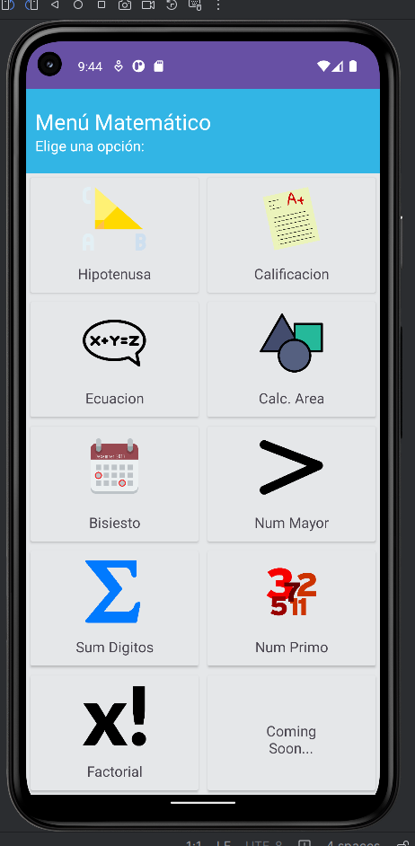

# University Project

Using Android Studio Java, create an application that provides the user with a math menu with options to use.

The project is not published in the Play Store, but I will be doing it and updating this repository.

### General menu

  

### When selecting

  

